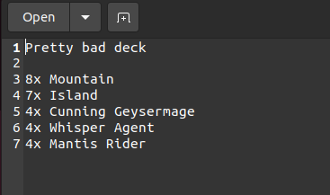

# Simple MTG Deck Builder

**Simple MTG Deck Builder** is (unsurprisingly) a very simple deck editor for Magic: The Gathering. It is powered by the [Scryfall's API](https://scryfall.com/docs/api) and, therefore, uses its search syntax.

The app can export the decks to plain text files, as well as saving them to .json files which can later be opened by it for further editing.

